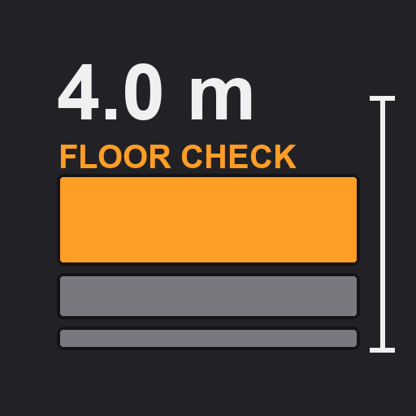
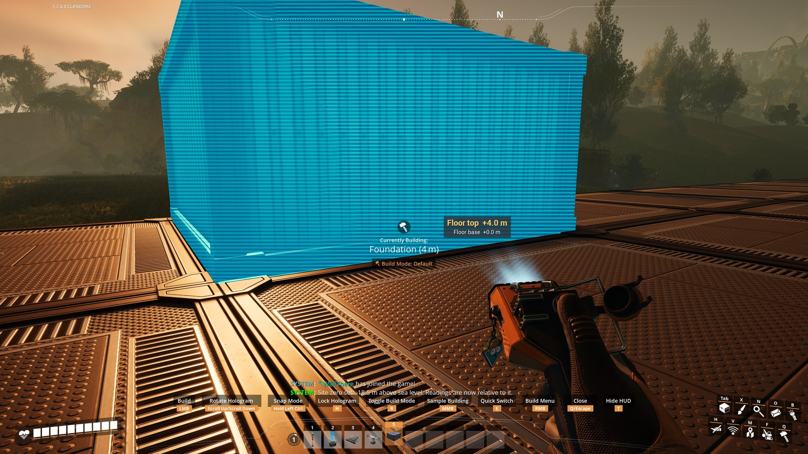
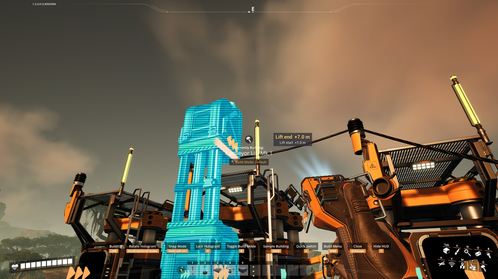
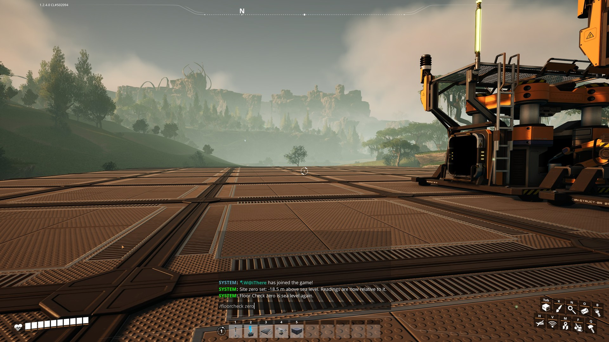

# Floor Check

**A [Satisfactory](https://www.satisfactorygame.com/) mod that tells you how high you are building.**

---

Hold a **foundation** or a **conveyor lift** in the build gun and a small readout appears beside the
crosshair, showing its height in metres and updating live as you move the hologram. Heights count from sea
level, or from a **site zero** you set yourself, so every floor of a factory lines up.

## Screenshots

*Stacking a foundation. **Floor top** is the surface you are about to create, **Floor base** the one you are stacking on.*

*A conveyor lift, reading both ends at once, so you know which floor it arrives on before you place it.*

*`/floorcheck zero` makes the floor you are standing on the new zero, so the rest of the build counts from your ground floor instead of sea level.*

## What it shows

| While you hold | Top line | Second line |
|---|---|---|
| A foundation | **Floor top** — the surface you are about to create | **Floor base** — the surface you are stacking on |
| A conveyor lift | **Lift start** | **Lift end** |

Zooped columns read to the top of the column, and ramps read their high end. The base line is hidden when
you place freely on the ground, because there is nothing to stack on.

## Commands

Type these in the in-game chat. `/fc` is a shorter alias for `/floorcheck`.

| Command | What it does |
|---|---|
| `/floorcheck` | Shows what the readout is measuring from right now |
| `/floorcheck zero` | Sets the site zero from the floor you are standing on |
| `/floorcheck zero 12.5` | Sets the site zero to an exact height in metres |
| `/floorcheck sea` | Back to measuring from sea level |
| `/floorcheck size 70` | Readout size in percent, anywhere from 50 to 200 |
| `/floorcheck size default` | Hands the size back to the settings page |
| `/floorcheck pos left` | Moves the readout. Also `right`, `top`, `bottom` |

The site zero is shared with everyone in the session and saved with the game. Size and position are stored on
your own computer and never sent to anyone else, so every player in a session picks their own. Size can also
be set from the pause menu under **Mods → Floor Check → Readout size**, though the chat command is the sure
route.

## Unlocking it

A Tier 1 HUB milestone called **Floor Check**: 10 Iron Rod + 10 Iron Plate, 30 seconds. It can still be
bought at the HUB terminal on a save that is already past Tier 1.

## Install

Through the [Satisfactory Mod Manager](https://ficsit.app/), or by hand: unzip
`FloorCheck-<version>-Windows.zip` into `<game>\FactoryGame\Mods\GameFeatures\FloorCheck\` so that
`FloorCheck.uplugin` sits directly in that folder. The Satisfactory Mod Loader (SML 3.12+) must be installed
first.

## Requirements

Satisfactory 1.2 (game build ≥ 491125), SML 3.12, built against Unreal Engine 5.6.1-CSS.

## Repository layout

| Path | What it is |
|---|---|
| `FloorCheck/` | the mod itself: `Source/FloorCheck/{Public,Private}`, `Config/`, `FloorCheck.uplugin` |
| `docs/screenshots/` | the images used on this page and on the mod page |
| `PLAN.md` | design and architecture, with the decision table (why each choice was made and how to flip it) |
| `BUILD_STEPS.md` | how to build and package the mod |
| `TEST_PLAN.md` | in-game test checklist, newest version first |
| `CHANGELOG.md` | player-facing changes per version |

## Building

The mod is C++ only and ships no `.uasset` files of its own. Put `FloorCheck/` into a Satisfactory Mod Loader
starter project under `Mods/GameFeatures/FloorCheck/`, build the `FactoryEditor Win64 Development` target,
then package with Alpakit. `BUILD_STEPS.md` has the long version.

## Credits

W@ithere. Built with the Satisfactory modding toolchain and SML.
